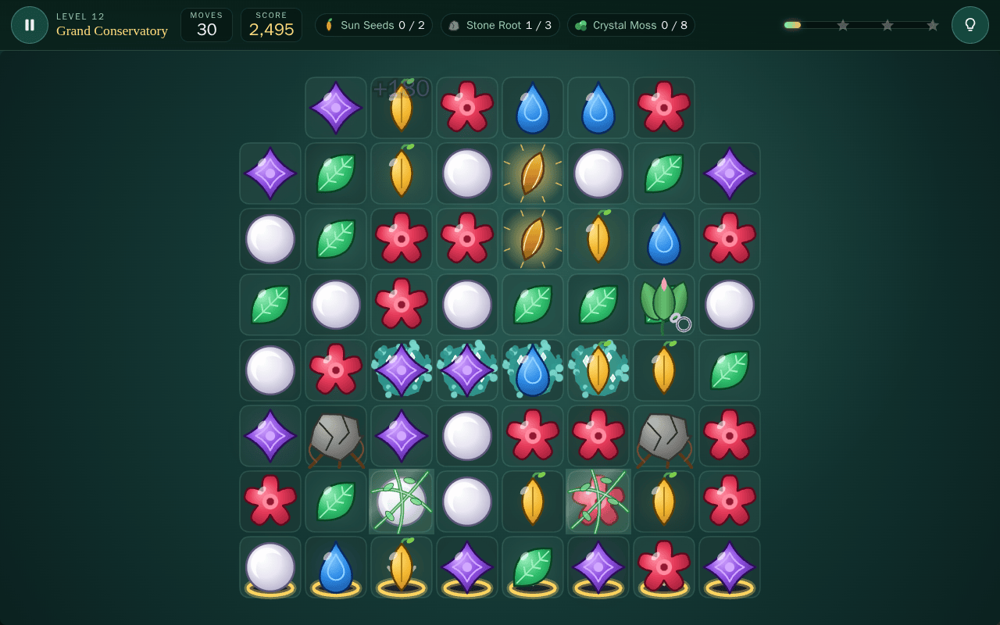

# Gem Garden

A browser match-3 about restoring a night-time greenhouse. Swap neighbouring gems to line up three or more, grow special pieces from bigger matches, and work through twelve beds with move limits, moss, roots, vines, locked buds, mist and falling sun seeds.

No backend, no assets to download. Every sprite is drawn on a canvas at load time, every sound is synthesised with the Web Audio API, and progress lives in localStorage.



## Running it

```bash
npm install
npm run dev      # http://localhost:5173
npm run build    # typecheck + production build into dist/
npm test         # vitest, board logic and level playability
```

Node 18 or newer. The only dependencies are Vite, TypeScript and vitest, all dev-only.

Add `?debug=true` to the URL for a panel with the game state, frame rate, cursor and selection, board seed, valid move count, active match groups, cascade index and a board validation line. It also has a grid-coordinate toggle and a "regenerate board" button.

## Controls

| Action | Mouse / touch | Keyboard |
|---|---|---|
| Select a gem | click or tap | Space or Enter |
| Swap | click a neighbour, or drag toward it | move the cursor to a neighbour, Space or Enter again |
| Move the cursor | | arrows or WASD |
| Pause | pause button | Escape or P |
| Restart the level | pause menu | R |
| Show a hint | hint button | H |

If the second Enter lands on a gem that is not next to the selected one, the selection moves there instead. Arrow keys and Space do not scroll the page while the board has focus. Every screen can be used without a mouse: dialogs take focus when they open and keep Tab inside them.

## The garden

Six gems, each with its own outline so they read without colour: Ruby Bloom (five petals), Azure Droplet (teardrop), Citrine Seed (pointed oval with a sprout), Violet Petal (four points), Jade Leaf (leaf with a vein) and Pearl Moonstone (circle with a crescent facet). High-contrast mode adds thick outlines and a letter in the middle of each one.

### Special pieces

| Match | Piece | What it does when swapped or matched |
|---|---|---|
| four in a line | Vine Beam | clears its whole row or column, along the direction of the match |
| T or L shape | Bloom Burst | clears the 3x3 around it |
| five in a line | Prism Core | swapped with a gem, removes every gem of that colour |

Swapping a special with anything is always a legal move. Two specials together do more:

| Pair | Result |
|---|---|
| Beam + Beam | full row and full column through the target, plus the 3x3 around it |
| Beam + Burst | three rows and three columns centred on the target |
| Burst + Burst | a 5x5 burst |
| Prism + Beam | every gem of the beam's colour turns into a beam, then they all fire |
| Prism + Burst | same, with bursts |
| Prism + Prism | the whole board |

Specials caught inside another effect fire too, so a beam that sweeps through a burst sets it off.

### Things in the way

- Crystal Moss sits under a gem. Clearing the gem on it removes one layer; thick moss has two. Some levels let it spread when a move leaves it alone.
- A Stone Root fills a cell and blocks falling gems. Match next to it, or hit it with a special, twice.
- A Glass Vine wraps a gem. The gem still matches but cannot be swapped; matching it shatters the vine.
- A Locked Bud seals a gem so it neither swaps nor matches. A match beside it, or a special, opens it and the gem stays.
- Shadow Mist hides a gem and behaves like a bud, except that it creeps onto a neighbouring gem after any move that did not burn some off.
- Sun Seeds enter at the top of marked columns and have to reach the soil at the bottom. They fall like gems, never match, and can be swapped straight down. Matching under one is the usual way to move it.

### Objectives, moves and stars

Levels ask for a score, a number of gems of one colour, all the moss, all of one kind of blocker, a number of delivered seeds, or several of those at once. Moves only count down after a legal swap. The level is won the moment every objective is done and lost when the moves run out first; cascades that are already in motion finish either way. Unused moves are worth 300 points each at the end, then the score is measured against the level's three star thresholds.

Scoring is in `src/game/Config.ts`. A match is 60 per gem for the first three and 25 for each extra, specials add 150 when they form and 250 when they fire, blocker hits are 100 (250 more when the blocker breaks), and each layer of moss is 80. Every step of a cascade multiplies its points by `1 + 0.5 * cascadeIndex`, and the HUD names the multiplier (Bloom Chain, Garden Cascade, Petal Storm).

### Levels

| # | Name | Introduces |
|---|---|---|
| 1 | Dew Terrace | plain matching, five colours |
| 2 | Moss Steps | six colours, Vine Beams |
| 3 | Fern Hollow | collect objective |
| 4 | Mossy Nook | Crystal Moss |
| 5 | Beam Walk | beams already on the board |
| 6 | Twin Bloom Beds | two-layer moss, two collect targets |
| 7 | Root Cellar | Bloom Bursts, Stone Roots |
| 8 | Glasshouse Row | Glass Vines |
| 9 | Seedfall Path | Sun Seeds |
| 10 | Bud Terrace | Prism Cores, Locked Buds |
| 11 | Mist Garden | Shadow Mist, a round board with holes |
| 12 | Grand Conservatory | everything, 36 moves |

Each level has a fixed seed, so a restart gives the same opening board.

## Settings and accessibility

Sound, ambient pad, hints, high contrast, reduced motion, text size and grid coordinates are all in the settings screen and saved with the rest of the progress. Reduced motion shortens every animation and turns off the idle glow. Meaning is never carried by colour alone: gems differ in shape, moss and mist have textures, and the objective list uses icons.

## How it works

### Layout

```
src/
  main.ts                 canvas check, creates the Game
  game/       Types, Config, Game (state machine and move flow), GameState,
              InputManager, AudioManager, SaveManager, DebugOverlay
  board/      Board, BoardCell, BoardGenerator, MatchFinder, MoveValidator,
              SpecialResolver, RoundResolver, GravitySystem, ReshuffleSystem
  entities/   Token, Blocker, Terrain, Seed factories
  levels/     the twelve LevelDefinitions and a small repository
  objectives/ one class per objective type plus the tracker
  systems/    AnimationSystem (tweens), ParticleSystem, ScoreSystem, HintSystem
  render/     AssetFactory (sprites), CanvasRenderer, EffectsRenderer, RenderFrame
  ui/         UIManager (HTML overlays), Icons, styles.css
  utils/      Random, MathUtils, EventEmitter
tests/        vitest suites, an ASCII board parser and a greedy bot
```

Board code never touches the DOM. `RoundResolver` and `GravitySystem` mutate the `Board` and hand back plain result objects (`ClearStep`, `FallStep`) that say which tokens left, which specials formed, which blockers took hits and what the score was. `Game` plays those back as tweens, particles and effects, then asks for the next step. Everything the renderer needs is in the step, so it never has to reconstruct history from the board.

### Board generation without starting matches

`BoardGenerator.generate` lays out holes, terrain, blockers, exits and any fixed tokens first, then fills the rest cell by cell in row-major order. For each empty cell it collects the colours that would not complete a run of three with the gems already placed to the left and above (and to the right and below, in case fixed tokens sit there), and picks one with the level's seeded RNG. A gem under a bud or mist cannot match, so it takes any colour. If a cell has no legal colour, or the finished board has no legal move, the attempt is thrown away and the fill starts over, up to `RULES.maxGenerationAttempts`.

### Swap validation and reversal

`MoveValidator.isValidSwap` first checks both cells are playable, hold a token and carry no blocker, and that they are orthogonal neighbours. Then it swaps the two tokens in place on the real board, asks `hasMatchAt` for each of the two cells (a run scan out from that cell along its row and column, no allocation), and swaps them back. A swap is legal if either cell now sits in a run of three, if either token is a special (specials fire on any swap), or if it moves a sun seed one row down. `findValidMoves` runs the same check over every adjacent pair, which is what the hint system and the reshuffle check use.

In `Game.moveFlow`, `RoundResolver.trySwap` commits the swap to the board only when it is legal. For a bad swap the board is untouched and the two tokens are tweened 60% of the way toward each other and back with an overshoot, and the move counter does not change. For a good one the tokens are already in their new cells, so the renderer starts each of them at its old cell offset and slides it home.

### Match detection and cascades

`MatchFinder.findMatches` scans every row and every column for runs of three or more matchable gems of one colour and records each run with an index into two scratch `Int32Array`s (one per orientation, sized to the board and reused across calls). A cell that belongs to both a horizontal and a vertical run joins the two runs with union-find, so T, L, plus and cross shapes come out as one `MatchGroup` with `orientation: "mixed"`, an `intersection` cell and `length` equal to the longest run. Cells are de-duplicated inside a group, and no cell appears in two groups.

`RoundResolver.resolveClear` takes all groups of a step at once. It decides special creation per group, marks those cells immune, and then builds one "reach" set from every group cell plus every cell an activated special touches. Any special sitting inside the reach set fires in place and grows the set, until nothing new is reached. Then in one pass it clears gems, knocks layers off moss, breaks vines, damages buds, mist and roots (once per blocker per step, from adjacency to a match or from being inside an effect) and scores everything with the cascade multiplier. `GravitySystem.apply` drops the survivors inside their column segments (a segment ends at a hole, a root or any blocker), refills each segment from its own top, and delivers any seed that came to rest on an exit. `Game` keeps calling `resolveClear` with an increasing cascade index until it returns `null`, then runs the end-of-move spreads and checks objectives.

### Special pieces

`SpecialResolver.chooseSpecial` looks at a group in the order prism (straight run of five or more), burst (has an intersection), beam (run of four, oriented along that run), and takes the first one the level allows. It is placed on the cell the player moved to if that cell is in the group, otherwise on the intersection, otherwise on the middle of the longest run. The token on that cell is turned into the special in place and keeps its id, so the renderer sees the same token change rather than a new one appear.

An activation is a list of cells. `effectCells` returns the cells an activation reaches for every special and every combination, along with the beam lines and burst radius the effects layer draws. `trySwap` classifies the pair being swapped with `classifyCombo`, and for prism combinations converts every matching gem on the board into the other special before firing all of them. The Game reads `ClearStep.activations` to draw beams, rings and the prism flash, and `shake` to decide whether the board shudders.

### Adding things

- Levels: append a `LevelDefinition` to `src/levels/levels.ts`. `tests/levels.test.ts` checks positions are inside the grid and off holes, collect colours exist in the palette, seed columns have an exit at the bottom of their top segment, star thresholds ascend, and that the board generates. `tests/playability.test.ts` then has the greedy bot in `tests/bot.ts` play it a few times so an impossible level fails CI.
- Objectives: subclass `Objective` in `src/objectives/`, react to `onClear`, `onFall` or `onScore`, and register the type in `createObjective` in `ObjectiveTracker.ts`. Add the union member to `ObjectiveDefinition` in `Types.ts` and an icon in `ui/Icons.ts`.
- Token types: add the colour to `TokenColor` and `ALL_TOKEN_COLORS`, give it a `TOKEN_STYLE` entry and a silhouette in `AssetFactory.drawGem`, plus an icon for the HUD.
- Blockers: add the type to `BlockerType`, a default hp in `entities/Blocker.ts`, its rule in `RoundResolver` (whether it is matchable, swappable and how it takes hits, see `BoardCell.isMatchable` and `isSwappable`), a segment rule in `GravitySystem.columnSegments` if it stops falling gems, and an overlay sprite in `AssetFactory`.
- Specials and boosters: add the type to `SpecialType`, a creation rule in `chooseSpecial`, its reach in `effectCells`, a `ComboKind` and a case in `classifyCombo` for how it pairs, then a sprite and an effect. Since activations are plain cell lists the resolver, renderer and scoring need no changes.

## Tests

`npm test` runs 259 checks: match shapes, swap rules, generation over hundreds of seeds, every special and combination on small hand-written boards, gravity through holes and around roots, seed spawning and delivery, reshuffle, scoring, objectives, saving, and a bot playthrough of all twelve levels. Boards in tests are written as ASCII, for example:

```
r a c
a r r
c a r
```
